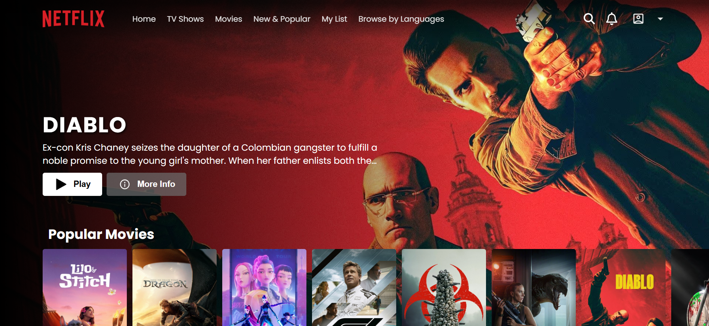

# Netflix Clone 🍿

A modern, responsive Netflix-inspired movie streaming application built with React and Firebase.



## ✨ Features

- **🎬 Browse Movies**: Explore a curated selection of movies with detailed info
- **🔍 Search**: Quickly find your favorite movies
- **🔐 Authentication**: Secure login and registration with Firebase Auth
- **📱 Responsive Design**: Optimized for all devices
- **🔥 Trending & Popular**: See what's hot right now
- **🎥 Movie Details**: View trailers, overviews, and more
- **⚡ Fast Performance**: Built with Vite for instant loading
- **🌙 Dark Theme**: Netflix-inspired modern UI

## 🛠️ Technologies Used

- **Frontend**: React 18
- **Routing**: React Router DOM
- **Authentication**: Firebase Auth
- **Notifications**: React Toastify
- **Build Tool**: Vite
- **Styling**: CSS Modules

## 🚀 Getting Started

### Prerequisites
- Node.js (v16 or higher)
- npm or yarn

### Installation

1. **Clone the repository**
   ```bash
   git clone <your-repo-url>
   cd 1-Netflix_Clone
   ```

2. **Install dependencies**
   ```bash
   npm install
   ```

3. **Start development server**
   ```bash
   npm run dev
   ```

4. **Open your browser**
   Navigate to `http://localhost:5173/Netflix_Clone/`

## 📦 Build for Production

```bash
npm run build
```

## 🌐 Deployment

### Vercel (Recommended)
```bash
npm install -g vercel
vercel
```

### Netlify
- Connect your GitHub repository
- Build command: `npm run build`
- Publish directory: `dist`

### GitHub Pages
```bash
npm run deploy
```

## 🎯 Key Features Implementation

### Authentication
- Secure login and registration with Firebase
- Route protection for authenticated users

### Movie Browsing
- Fetch and display movies in rows (trending, popular, etc.)
- Movie details modal with overview and trailer

### Responsive Design
- Mobile-first layouts
- Adaptive grid and flexbox

## 🔧 Project Structure

```
src/
├── assets/              # Images and static assets
├── components/          # Reusable UI components
│   ├── Navbar/          # Top navigation bar
│   ├── Footer/          # Footer section
│   ├── Main/            # Main content area
│   └── MovieRow/        # Movie row display
├── pages/               # Page components (Home, Login, MovieDetails)
├── firebase/            # Firebase config
├── index.css            # Global styles
├── App.jsx              # Main app component
└── main.jsx             # Entry point
```

## 🎨 Design System

- **Primary Color**: Netflix Red (`#e50914`)
- **Background**: Dark theme
- **Typography**: Clean, bold fonts
- **UI**: Inspired by Netflix's modern look

## 📱 Browser Support

- Chrome (latest)
- Firefox (latest)
- Safari (latest)
- Edge (latest)

## 🤝 Contributing

1. Fork the repository
2. Create a feature branch
3. Commit your changes
4. Push to the branch
5. Open a Pull Request

## 📄 License

This project is open source and available under the [MIT License](LICENSE).

## 🙏 Acknowledgments

- [Firebase](https://firebase.google.com/) for authentication
- [React Toastify](https://fkhadra.github.io/react-toastify/) for notifications
- [Vite](https://vitejs.dev/) for fast development

---

**Built with ❤️ by salim**
